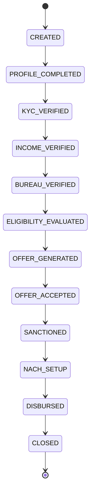

# Loan Journey States & Transitions

This document defines the **loan application state machine**, including
valid transitions, terminal states, and operational overrides.

The design is intentionally strict to ensure:
- auditability
- predictable behavior
- cost control
- safe retries

---

## 1. Core Principles

- **Users are never rejected — loan applications are**
- Each loan application has a unique `loanApplicationId`
- Once rejected, a loan application is **terminal**
- Re-application always creates a **new loanApplicationId**
- All state transitions are persisted in DB (source of truth)

---

## 2. State Machine (Versioned)

State machines are **versioned** to support policy evolution without breaking
in-flight or historical loans.

Example:
- `LOAN_FLOW_V1`
- `LOAN_FLOW_V2`

Each loan application is permanently associated with a flow version.

---

## 3. Primary States

---

## 4. Terminal States
- REJECTED
- EXPIRED
- CANCELLED

### Terminal State Rules
- No transitions allowed out of terminal states
- Any retry requires a **new loan application**
- Terminal reason is mandatory and immutable

---

## 5. Rejection Philosophy (Fail Fast)

The platform follows a **sequential evaluation model**.

Example order:
1. Income verification
2. Bureau check
3. Eligibility evaluation

If a stage fails:
- Loan moves immediately to `REJECTED`
- Remaining stages are **not executed**
- Rejection reason is persisted

This avoids:
- unnecessary vendor cost
- delayed customer feedback
- complex partial states

---

## 6. Source of Truth

| Artifact | Role |
|------|------|
| Database | **Authoritative state** |
| Kafka events | Derived / replayable |
| Camunda workflow | Orchestration only |

If events are lost or delayed:
- State can always be reconstructed from DB
- Events can be re-emitted safely

---

## 7. State Transitions

### Allowed Transition Rules
- Transitions are validated by `loan-application-service`
- Invalid transitions are rejected at API level
- Each transition:
    - persists previous state
    - records timestamp
    - emits a domain event

Example:
INCOME_VERIFIED → BUREAU_VERIFIED ✅
INCOME_VERIFIED → SANCTIONED ❌

---

## 8. Ops & Manual Overrides

### Ops Capabilities
- Move loan between **non-terminal states**
- Retry failed stages
- Pause or resume journeys

### Restrictions
- Ops CANNOT move a loan out of `REJECTED`
- Ops actions are:
    - authenticated
    - authorized
    - fully audited

Every manual override generates:
- audit record
- Kafka event
- operator metadata

---

## 9. Retry & Compensation

- Retries are handled by workflow-service
- Each retry has:
    - max attempt count
    - backoff policy
- On exhaustion:
    - loan moves to `REJECTED`
    - reason code is mandatory

---

## 10. Why This Design Works

- Simple mental model
- Strong audit guarantees
- Cost-efficient execution
- Safe re-application handling
- Supports regulatory scrutiny

